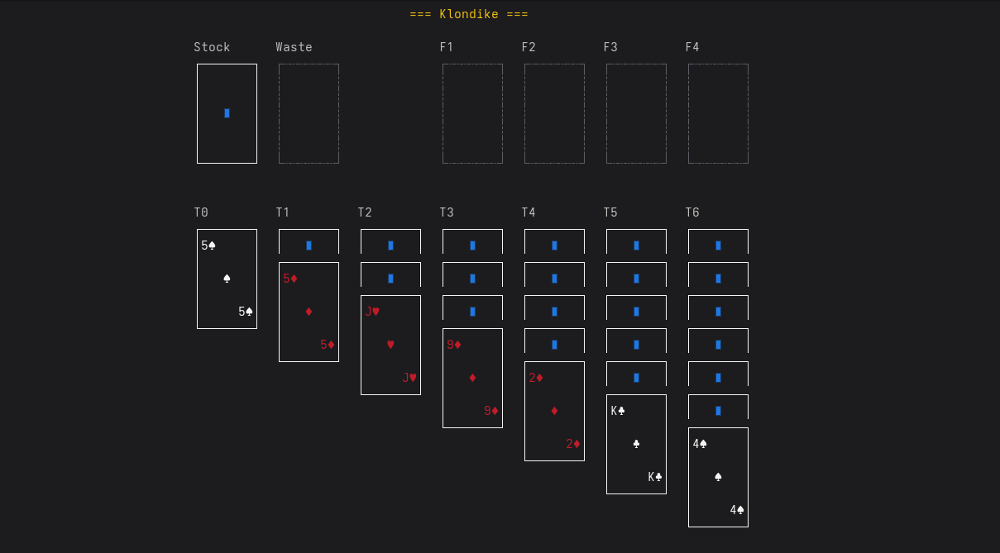
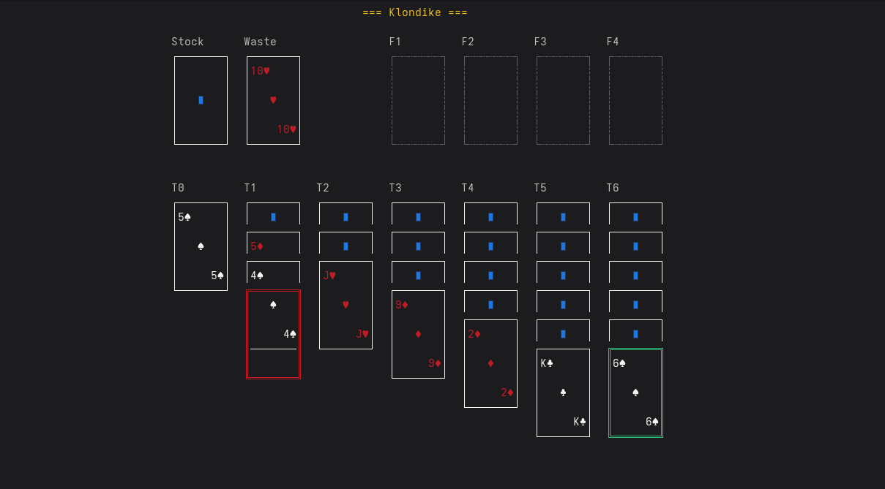
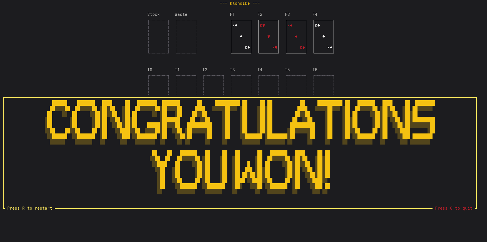

# Solitaire Imagined

A terminal-based game of Klondike Solitaire built with Rust and the [ratatui](https://ratatui.rs/) TUI framework. 

So you can game on the DNS Server.


### UI



Provides a sleek retro design, your CLI agent will love.

## Features

Includes:
- Mouse & Keyboard controls 
- Drag and Drop functionality
- Autoclick



And includes a win screen and animation




## Installation

```bash
cargo install solitaire
```

## Usage

Simply run:
```bash
solitaire
```


## Controls

- Mouse: Click to select and move cards
- Keyboard: Navigate with arrow keys, select with Enter/Space
- Press `?` or `h` for help menu
- Press `Esc` to open options menu

